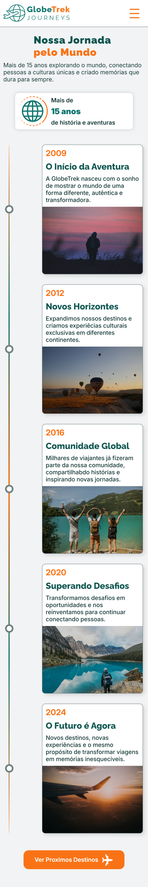
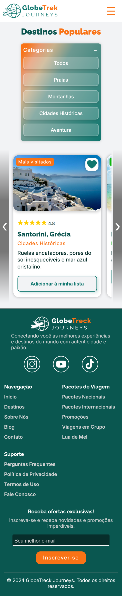

# 🌍 GlobeTrek Journeys

Projeto desenvolvido como parte da minha jornada de aprendizado em desenvolvimento web, com foco na criação de uma experiência visual e interativa para uma agência fictícia de viagens e experiências culturais.

A **GlobeTrek Journeys** apresenta a história da empresa por meio de uma timeline, destacando seus principais momentos desde a fundação até os dias atuais.

O projeto também conta com uma segunda página dedicada a destinos populares, com filtros e interação em JavaScript.

---

## ✨ Sobre o projeto

O principal objetivo deste projeto foi desenvolver uma **timeline responsiva**, utilizando diferentes recursos de HTML, CSS e JavaScript para criar uma experiência visual agradável e adaptável a diferentes tamanhos de tela.

Uma das principais propostas deste projeto foi mudar minha abordagem de desenvolvimento.

Nos projetos anteriores, eu costumava começar pelo **desktop** e depois adaptar o layout para telas menores. Neste projeto, decidi fazer o caminho inverso:

> **O projeto foi desenvolvido primeiro para dispositivos móveis e, posteriormente, adaptado para tablet e desktop.**

Essa mudança me permitiu praticar o desenvolvimento **mobile-first** e pensar na estrutura e na experiência do usuário desde as menores telas.

---

## 🖼️ Preview

<div align="center">
  <table>
    <tr>
      <td align="center"><strong>Página inicial</strong></td>
      <td align="center"><strong>Destinos Populares</strong></td>
    </tr>
    <tr>
      <td align="center" valign="top">
        
      </td>
      <td align="center" valign="top">
        
      </td>
    </tr>
  </table>
</div>

---
## 🧭 Páginas

### 🏠 Início

A página principal apresenta a história da GlobeTrek Journeys através de uma timeline com diferentes marcos da empresa:

- 2009 — O Início da Aventura
- 2012 — Novos Horizontes
- 2016 — Comunidade Global
- 2020 — Superando Desafios
- 2024 — O Futuro é Agora

Cada evento apresenta ano, título, descrição e imagem ilustrativa.

A página também conta com:

- Título principal com destaque visual;
- Contador de mais de 15 anos de história;
- Animações de entrada dos eventos;
- Barra de progresso da leitura;
- Botão para voltar ao topo;
- Botão de acesso à página de destinos.

### 🗺️ Destinos Populares

A segunda página apresenta uma seleção de destinos turísticos ao redor do mundo.

Nela foram implementados:

- Filtro por categorias;
- Carrossel de destinos;
- Cards com imagens;
- Avaliações com estrelas;
- Categorias dos destinos;
- Badges de destaque;
- Botão para adicionar destinos à lista;
- Sistema de curtidas;
- Mapa ilustrativo;
- Interações desenvolvidas com JavaScript.

Categorias disponíveis:

- Todos
- Praias
- Montanhas
- Cidades Históricas
- Aventura

---

## 💻 Tecnologias utilizadas

- HTML5
- CSS3
- JavaScript
- CSS Variables
- Flexbox
- CSS Grid
- Media Queries
- LocalStorage
- Google Fonts

---

## 🎨 Identidade visual

O projeto utiliza uma identidade visual inspirada em viagens, aventura e exploração.

### Cores

| Cor | Código | Utilização |
| --- | --- | --- |
| 🟠 Laranja | `#F97316` | Cor principal |
| 🟢 Verde petróleo | `#0F766E` | Cor secundária |
| ⚪ Cinza claro | `#F1F5F9` | Fundo |

### Tipografia

- **Raleway** — títulos
- **Inter** — textos e informações

---

## 📱 Responsividade

O projeto foi desenvolvido seguindo uma abordagem **mobile-first**.

A estrutura foi construída inicialmente pensando em telas pequenas e posteriormente adaptada para diferentes tamanhos de tela.

### Mobile

- Timeline simplificada;
- Cards empilhados;
- Carrossel horizontal na página de destinos;
- Navegação adaptada para telas menores.

### Tablet

- Ajustes de espaçamento e dimensões;
- Timeline centralizada;
- Organização dos elementos para melhor aproveitamento da tela.

### Desktop

- Timeline vertical com cards alternados;
- Layout mais amplo;
- Página de destinos organizada para telas maiores;
- Ajustes de proporção, espaçamento e posicionamento.

---

## ⚙️ Interações com JavaScript

O JavaScript foi utilizado para adicionar interatividade ao projeto, incluindo:

- Animação de entrada dos eventos da timeline;
- Botão de voltar ao topo;
- Barra de progresso da página;
- Filtro de destinos;
- Navegação do carrossel;
- Sistema de curtidas;
- Armazenamento de informações utilizando `localStorage`;
- Interação do formulário de ofertas.

---

## 📂 Estrutura do projeto

```text
GlobeTrek-Journeys/
│
├── assets/
│   ├── css/
│   │   ├── responsive.css
│   │   ├── style.css
│   │   └── variables.css
│   │
│   ├── icons/
│   ├── img/
│   └── js/
│       └── script.js
│
├── pages/
│   └── destino.html
│
├── preview/
│
├── index.html
└── README.md
```
## 👨‍💻 Autor

Desenvolvido por **Henrique Lins**.

- LinkedIn: [Henrique Lins](https://www.linkedin.com/in/henrique-lins-aragao/)